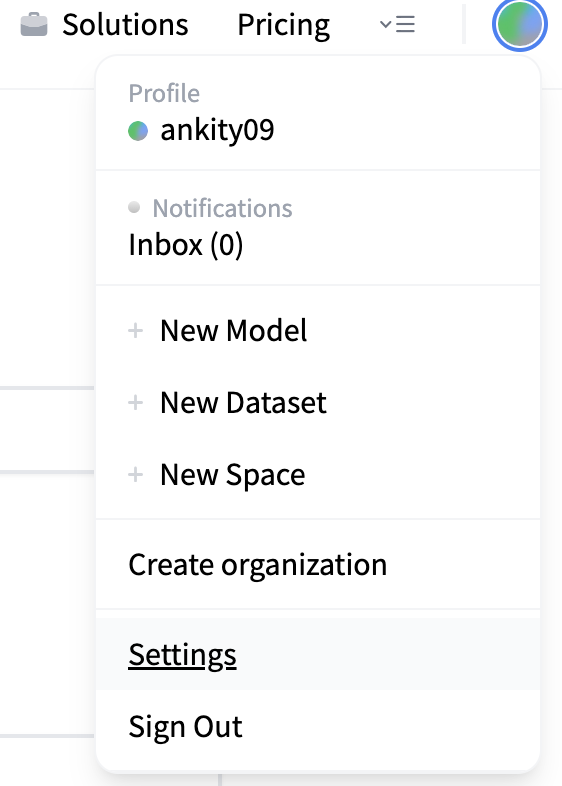
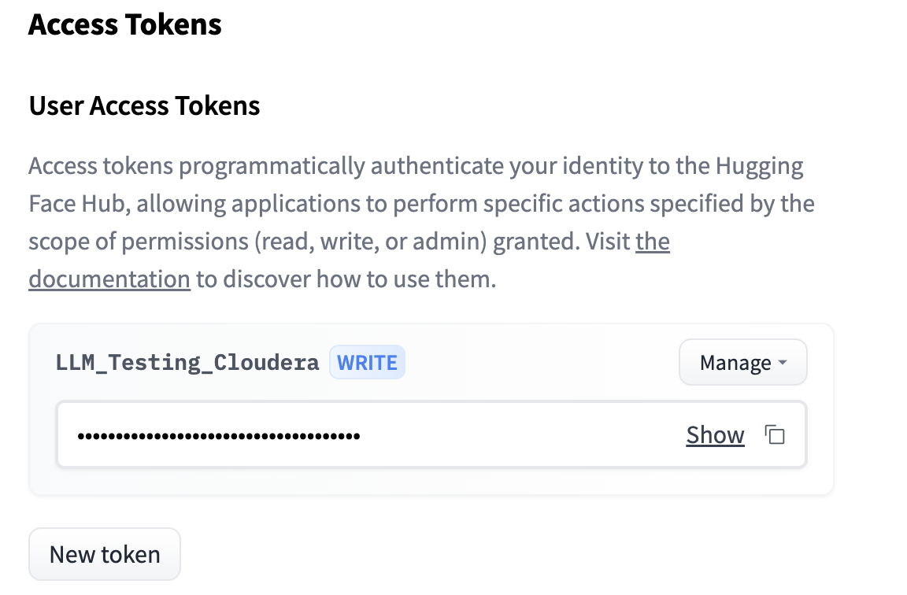
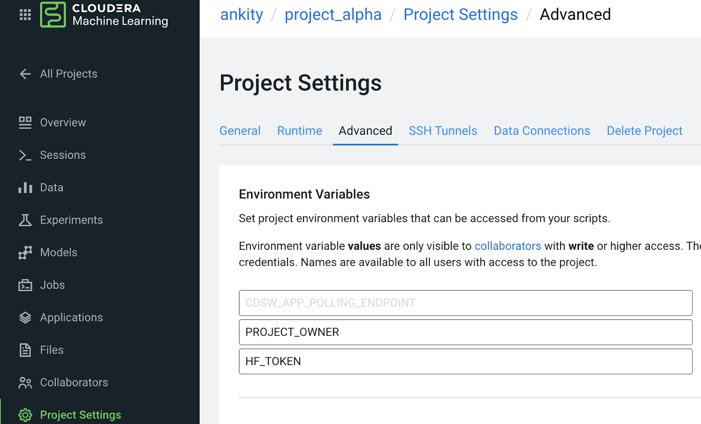

# Using Llama-2 within the AMP

Meta’s Llama-2 is a recently released LLM model which requires additional access from Meta. The official request form can be found [here](https://ai.meta.com/resources/models-and-libraries/llama-downloads/). The Acceptance email will contain a personal URL which can be used on [HuggingFace](https://huggingface.co/meta-llama) to access the Gated model and download for use in the AMP.

Once you have access to the Gated Model on Hugging Face


You will need to copy your HuggingFace Token into the Project Environment Variable by following these steps
1. Navigate to the Settings Page of your Profile on HuggingFace



2. Click on the Access Tokens Tab and generate a new token if you do not already have one



3. Copy this token and navigate to the CML Project’s Project Settings and the Advanced Tab



4. Add the variable “HF_TOKEN” as the Key and the copied Token Value from the previous step as the Value.

5. In the gradio_app/app.py file, change the following lines 

Update the model name to either “llama-2-7b” or “llama-2-13b”
```python
class CFG:
    model_name = 'falcon' # vicuna, llama-2-7b, llama-2-13b, falcon
```
Uncomment the “access_token” variable
```python
# Uncomment the below lines to use Llama-2
access_token = os.environ["HF_TOKEN"]
!huggingface-cli login --token $HF_TOKEN
```
